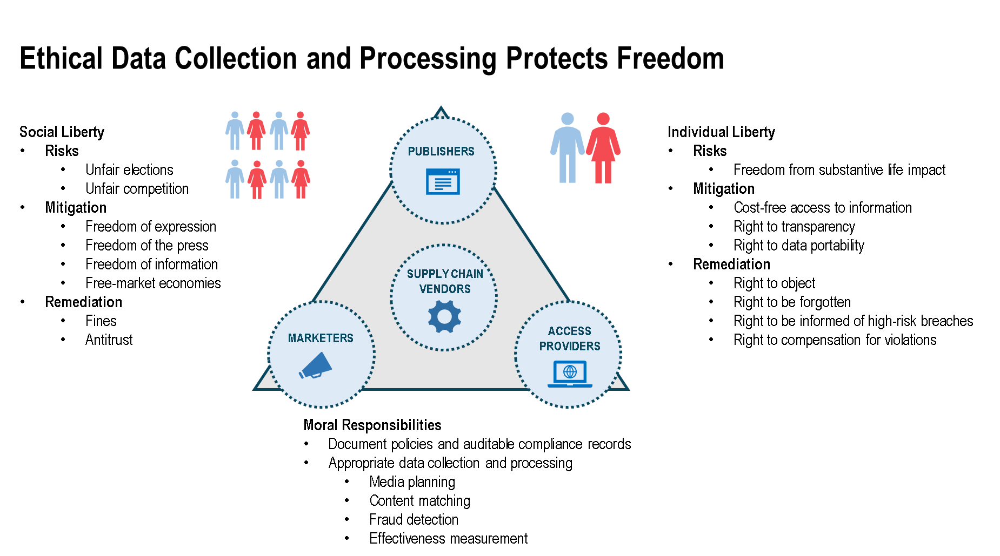
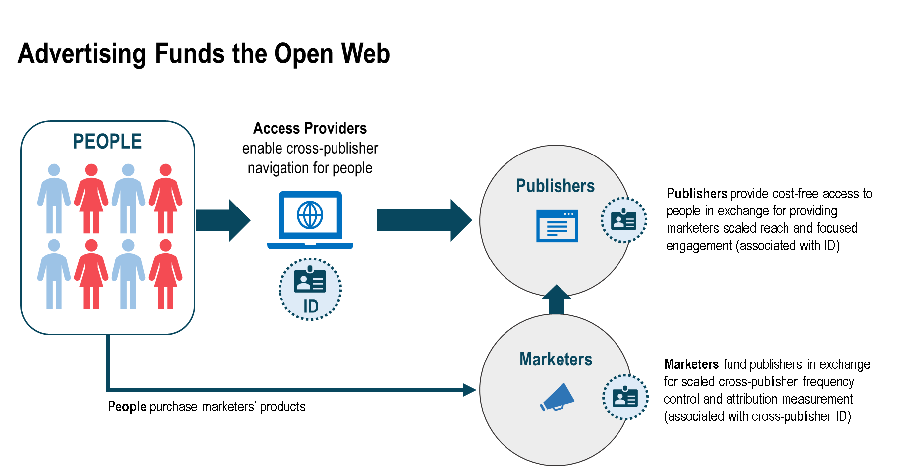
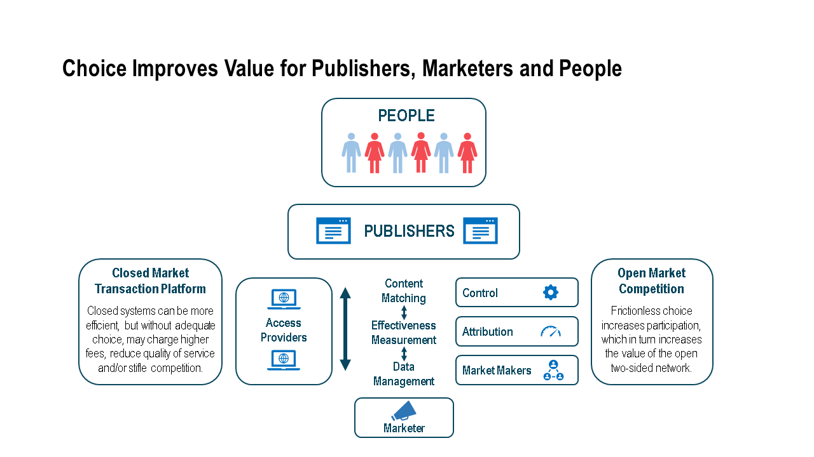

W3C Improving Web Advertising Business Group - Success Criteria in reference to Individual, Social and Business Concerns
========================================================================================================================

W3C Unofficial Draft 14th October 2020

Master Document:
https://51degrees.sharepoint.com/:w:/g/EVF1fwHC_bxMpyBBg9amcVQBtIkJOQo4PB9DCpaBklEq3A

Editor:

James Rosewell (james@51degrees.com)

Contributors:

Alan Chapell (achapell@chapellassociates.com)

Anthony Rouillot (anthony@adcash.com)

Ari Paparo (ari@beeswax.com)

Arnaud Blanchard (a.blanchard@criteo.com)

Brad Rodriguez (brodriguez@rubiconproject.com)

Daniel Sepulveda (dsepulveda@mediamath.com)

David St. Pierre (dgstpierre2@gmail.com)

Hardeep Bindra (hbindra@gmail.com)

Ian Meyers (imeyers@liveramp.com)

Ingmar Zach (izach@liveintent.com)

Jochen Schlosser (Jochen.Schlosser@adform.com)

John Sabella (john.sabella@pubmatic.com)

Joshua Koran (jkoran@zetaglobal.com)

Kristoffer Nelson (knelson@srax.com)

Nick Jordan (nick@narrative.io)

Paul Bannister (paul@cafemedia.com)

Paul Chachko (pchachko@throtle.io)

Rotem Dar (r.dar@eyeo.com)

Scott Menzer (scott@id5.io)

Tom Kershaw (tkershaw@rubiconproject.com)

Taha Dharamsi (tdharamsi@postmedia.com)

Walter Knapp (walter@sovrn.com)

Wilfried Schobeiri (wschobeiri@mediamath.com)

Acknowldegement
---------------

This software or document includes material copied from or derived from 
[Self-Review Questionnaire: Security and Privacy](https://www.w3.org/TR/security-privacy-questionnaire/). 
Copyright © 2020 W3C® (MIT, ERCIM, Keio, Beihang).

Abstract
--------

We have a shared goal of preserving the web as an open platform for diverse and
rich experiences provided by multiple parties. Towards this end, Improving Web
Advertising Business Group goal is to provide monetization opportunities that
support the open web while balancing the needs of publishers and the advertisers
that fund them, even when their interests do not align, with improvements to
protect people from the individual and societal impacts of tracking content
consumption over time.

This document surveys the body of prior W3C, IETF, regulators, legal, trade
bodies and other work to consolidate it into a single document with associated
commentary to inform the work of the Business Group. The chapters bring relevant
commentary together around the needs of society, people, publishers, advertisers
and access providers.

Introduction
------------

The open web has become a critical global utility that supports the free flow of
communication, commerce, content and competition. The open web is increasingly
becoming the primary method used by citizens to access news, communicate with
each other, engage with governments, conduct commerce and consume entertainment.
Any individual, business, charity or government organization regardless of
background, geography or wealth can now cost effectively participate in this
global resource. A set of common technical and policy standards makes all this
possible.

The web is an open platform. Interoperability is a fundamental principle that
supports all web technologies and is enshrined in the [W3C Membership
Agreement](https://www.w3.org/2009/12/Member-Agreement) purpose
[MEMBERSHIP-AGREEMENT]. Existing specifications and protocols for encoding,
transmitting and rendering information facilitate these exchanges. Data
portability also helps ensure that the web is interoperable as defined in [GDPR,
Recital 68](https://gdpr.eu/recital-68-right-of-data-portability/)
[GDPR-RECITAL-68].

The web underpins billions of dollars of commercial transactions. Accordingly,
any proposed change to the underpinning policy and technical standards could
have global ramifications. No one individual can understand every ecosystem
dependency. The Internet Engineering Task Force (IEFT) emphasizes the full range
of stakeholders to consider when contemplating change:

>   *the IETF is concerned with developing and maintaining the Internet to
>   promote the social good, and the society that the IETF is attempting to
>   enhance is composed of end users, along with groups of them forming
>   businesses, governments, clubs, civil society organizations, and other
>   institutions.* ([Draft - Internet Architecture Board for the End
>   Users](https://intarchboard.github.io/for-the-users/draft-iab-for-the-users.html)
>   [INTERNET-FOR-END-USERS]).

This does not mean that all stakeholders are unanimously agreed on how to
"improve" the web. Scholars describe diverging interests of stakeholders as a
"tussle."

>   *The resulting tussles span a broad scope: the rights of the individual vs.
>   the state, the profit seeking of competitors, the resistance to those with
>   malicious intent, those with secrets vs. those who would reveal them, and
>   those who seek anonymity vs. those would identify them and hold them
>   accountable*. ([Tussle in
>   Cyperspace](http://groups.csail.mit.edu/ana/Publications/PubPDFs/Tussle2002.pdf)
>   [TUSSLE]).

Achieving a balance across the diverse interests of global stakeholders when
determining trade-offs among speed, fairness, security, public accountability,
diversity and quality is in accordance with [values of the
W3C](https://www.w3.org/standards/about.html) [ABOUT-STANDARDS]. To resolve this
tussle in the interests of all stakeholders requires us to carefully examine
what alternate means are possible to reach the desired goals. If a negative
effect on one or more groups of stakeholders is unavoidable, then the reasoning
behind this decision ought to be thoroughly documented.

This document considers web advertising from four [points of
view](https://www.w3.org/Consortium/Points/)[POINTS]: that of individual web
users (both in aggregate and individually), publishers, and the supply chain
that funds them, and the delivery access mechanism (both connectivity and
navigation).

Any technology can be abused. Open societies consider all technologies but
define ethical, unethical and inappropriate uses and regulate or restrict
accordingly. Documenting specific criteria as to what constitutes an ethical,
unethical or inappropriate use of a technology helps enable easier detection and
reporting of non-compliance with the regulations that govern societies and
support the process of constructing such regulations. For example, automobiles
are not required to integrate functionality that technically prevents them from
exceeding the speed limit. Instead, drivers are educated and trained in traffic
rules, and drivers who violate speed limits are subject to fines and/or deprived
of their permits. However, documenting specific criteria as to what constitutes
a violation helps enable easier detection and reporting of non-compliance with
the regulations that govern technology.

By documenting the defined norms and principles behind appropriate and
inappropriate data collection and processing, we can better devise methods of
accountability. This accountability requires each participant that has access to
data collection and processing to abide by its responsibility not to abuse the
data under its control. This in turn requires definitions of legitimate data
collection and processing as well as transparency around whether the data
controller has fulfilled its obligations. One of the first assumptions we
document is that an advertising-funded business model supports the open web and
is a business model that positively impacts people. Impacts to the granularity,
accuracy, and timeliness of feedback mechanisms to marketers impacts the value
of media, due to the impact to their ability to control or measure their media
spend. People increasingly understand advertising funds their free access to the
open web. However, they join politicians, publishers and advocates in a desire
for improved transparency and individual control over their personal data.

Privacy
-------

Individual privacy is a critical issue that societies around the world must
address [EFF-INT-PRIV-STD]. Given the pervasiveness of internet-enabled content
and services that support modern societies, it is important we protect people's
privacy while ensuring we do not undermine important societal goals.

Tracking content consumption over time poses risks to people. The measures
required to protect people’s important privacy rights should account for and be
proportionate to the risk of harm. Privacy regulations have identified numerous
harms from these risks. Some of these harms impact society, including
manipulation of political elections by foreign parties, discrimination against
protected classes, and fraud. Some of these harms impact individuals, such as
using content consumption activity ("behavior") in a manner that causes a
negative substantive life impacts on people's access to healthcare, financial
resources or infliction of emotional distress, or is deceptive manipulation.
These harms pose risks not just to the individual but also to the larger society
in which people live.

People’s awareness and understanding of their rights is improving in
jurisdictions where legal frameworks such as GDPR have been introduced ([EDAA
Consumer Research Analysis June
2020](https://www.edaa.eu/wp-content/uploads/Consumer-Research-Analysis-June-2020.pdf)
[CONSUMER-RESEARCH]). People now expect their consent choices to be respected.

The General Data Protection Regulation (the “GDPR”) in the EU is widely
recognized as offering a thorough evaluation of the myriad of interests
associated with privacy and data protection. Since May 2018, dozens of
jurisdictions worldwide have adopted all or part of the GDPR. While different
regions may impose different rules, the concepts outlined within the GDPR are
helpful input into the privacy considerations outlined.

As GDPR concisely states, data protection must be balanced with these other
fundamental rights:

>   *The processing of personal data should be designed to serve mankind. The
>   right to the protection of personal data is not an absolute right; it must
>   be considered in relation to its function in society and be balanced against
>   other fundamental rights, in accordance with the principle of
>   proportionality. This Regulation respects all fundamental rights and
>   observes the freedoms and principles recognized in the Charter as enshrined
>   in the Treaties, in particular the respect for private and family life, home
>   and communications, the protection of personal data, freedom of thought,
>   conscience and religion, freedom of expression and information, freedom to
>   conduct a business, the right to an effective remedy and to a fair trial,
>   and cultural, religious and linguistic diversity.* -- [GDPR, Recital
>   4](https://gdpr.eu/recital-4-data-protection-in-balance-with-other-fundamental-rights/)
>   [GDPR-RECITAL-4]

In an effort to balance these interests, many privacy regulations describe the
privacy risks to people relative to the scale, sensitivity of the data collected
and potential of a significant economic or social impact from its inappropriate
processing. Accordingly, data minimization, purpose limitation, limited storage,
and reliance on pseudonymous identifiers are often recommended to minimize these
risks. (GDPR, Art. [5](https://gdpr.eu/article-5-how-to-process-personal-data/),
[25](https://gdpr.eu/article-25-data-protection-by-design/); [Recital
78](https://gdpr.eu/recital-78-appropriate-technical-and-organisational-measures/)
[GDPR-ART-5], [GDPR-ART-25], [GDPR-RECITAL-78]) While data collection and
processing should not be presumptively inappropriate, organizations must account
for their use of personal information and mitigate potential harms. Indeed, many
privacy regulations require organizations to declare a lawful basis to perform
personal data collection and processing. (GDPR,Art.
[5(1)](https://gdpr.eu/article-5-how-to-process-personal-data/) [GDPR-ART-5])
For this reason, organizations must keep appropriate records to demonstrate
their compliance with privacy regulations. (GDPR,Art.
[5(2)](https://gdpr.eu/article-5-how-to-process-personal-data/) [GDPR-ART-5])

Moreover, privacy regulations and national laws often provide specific and
appropriate remedies for violations of their codes of conduct. Ensuring improved
accountability is a chief principle of improving web advertising.

### Trust and Interoperability Among Decentralized Parties

[W3C mission](https://www.w3.org/Consortium/Points) [POINTS] is to provide
"technologies (specifications, guidelines, software, and tools) that will create
a forum for information, commerce, inspiration, independent thought, and
collective understanding." Trust and interoperability are two of the core goals
in support of W3C's mission.

Trust requires a system that supports confidentiality, instils confidence, and
makes it possible for people to take responsibility for (or be accountable for)
what they publish on the Web." [W3C
mission](https://www.w3.org/Consortium/Points) [POINTS] By improving both
transparency and accountability we can ensure market actors earn trust while
enhancing efficiency, efficacy, and fairness in the matching of advertising
content to people.

Much of the web consists of embedded content and centralized services provided
to decentralized publishers (e.g., single sign on, web payments, advertising).
People trust many of the brands they purchase or interact with. Behind most of
these brands are numerous supply chain partners that enable people to benefit
from each brand's end product or service. Digital publishers are no different.
Independent publishers must rely on networks of direct partners and indirect
partners of the marketers that fund their operations. Whether the reliance on
these supply-chain vendors is for cross-publisher budget management services,
independent verification, and authentication services, their objectivity is
necessary for accountability, transparency and reconciliation purposes. This
interoperability is a goal in support of W3C's mission and the first principle
in support of improved web advertising. The trust in this interoperable network
requires transparency, reliable and consistent controls for both end users,
publishers and marketers, and improved documentation of acceptable and
unacceptable uses of data. Organizations must be transparent about the personal
information they collect and how they use it. Organizations must responsibly use
this personal information that is compatible with the interests of individuals
and society, and be held accountable if they abuse this responsibility.

[Some
organizations](https://assets.publishing.service.gov.uk/media/5d78ba3540f0b61c7a66407c/190802_Google_-_Response_to_SoS__Non-confidential_.pdf)
[GOOGLE-RESPONSE] have pointed out that transparency is advanced by
vertical-integration. "Opacity sometimes is a function of fragmentation....
Vertical integration can sometimes resolve some of the concerns around a lack of
transparency and complexity.... Vertical integration means there is a single
point of contact for advertisers and publishers and it eliminates concerns about
the possibility of rent-seeking by difficult-to-identify themselves
intermediaries.... vertical integration in the ad tech state creates
efficiencies for users. Changes ought to benefit all stakeholders, not just one
set."

While vertical integration can simplify consumer transparency, it carries the
danger of limiting consumer choices by bundling services. By contrast, the final
sentence in the quote above emphasizes decentralization, which is a third goal
in support of [W3C's mission:](https://www.w3.org/Consortium/Points)
"Decentralization is a principle of modern distributed systems, including
societies." Among the rationales supporting decentralization are choice and the
freedom of information. These rationales help keep the market innovative,
competitive and open to new entrants.

The goals of this Business Group should be to understand how and why the
interactions of users, publishers, ad technologies and marketers counteract or
conflict with the goals of privacy-preserving users and regulations. Then to
find and propose measures by which systems of publishers, technologies and
marketers can be adjusted to continue to create profitable operations that
supports a variety of freedoms in balance with individual privacy interests. The
IETF's Internet Architecture Board (IAB) also expressed concerns as to growing
consolidation of power on the Internet.

>   *While the IAB, the Internet Society, and others are examining this
>   phenomenon to understand it better, it is nevertheless prudent to consider
>   whether proposals for changes to how the Internet works favors or counters
>   consolidation. Favoring entities with existing advantages - like resources,
>   size, or market share - is not necessarily a factor that disqualifies a new
>   proposal, but it needs to be considered as a cost of enabling that
>   technology.* ([Draft - IAB ESCAPE
>   Report](https://tools.ietf.org/html/draft-iab-escape-report-00)
>   [ESCAPE-REPORT]).

The 2019/20 UK [Competition and Market Authority (CMA) studied online platforms
supported by digital
advertising](https://www.gov.uk/cma-cases/online-platforms-and-digital-advertising-market-study)
[CMA-REPORT]. The [CMA set out five
goals](https://assets.publishing.service.gov.uk/government/uploads/system/uploads/attachment_data/file/814709/cma_digital_strategy_2019.pdf)
[CMA-STRATEGY] for supporting a trusted, decentralized, interoperable open web,
whose operation relies on web advertising:

1.  promoting "competition for the benefit of consumers";

2.  ensuring "the enormous innovation and benefits brought about through
    digitization can continue";

3.  creating a "level playing field" for all businesses to compete on the
    merits;

4.  ensuring new competitors can enter digital markets; and

5.  enabling people "to feel trust in online markets.

The above principles for an interoperable web seek to help advance the mission
of the W3C as well as further the objectives outlined by the UK CMA "to promote
competition for the benefit of consumers, both within and outside the UK, to
make markets work well for consumers, businesses, and the economy." To ensure a
level playing field, it is important that smaller organizations be able to rely
on supply chain vendors, and to have those vendors operate transparently and
with interoperability. This not only requires standards of the communication
among organizations that encourages existing competition within the market, but
also to ensure changes in web technology do not discourage new market entrants.

The W3C’s anti-trust guidance [W3C-ANTI-TRUST] guidance fully supports the
position of the CMA with the statement “W3C does not … in any way restrict
competition” and “W3C's policy is that its activities are conducted to the
highest ethical standards and in compliance with all applicable antitrust and
competition laws and regulations”. Proposals which seek to discriminate between
parties must be assessed not only against these criteria but also against the
anti-trust policy of the W3C.

### Principles for Improving Interoperable Web Advertising

The key stakeholders involved in web advertising include individual and groups
of people, publishers, marketers, their supply chain vendors and delivery access
providers. We believe the majority of these interests are compatible with each
other in ensuring people have their rights protected and receive better
products, which is advanced through free market competition.

The following sections outline the key interests and principal goals for each
stakeholder group.

#### Interests of Society

-   Diversity of publishers that protects:

    -   Freedom of expression to represent minority voices

        -   Free elections protected against foreign manipulation

        -   Free speech requires allowing speech which the majority does not
            approve of

        -   Freedom of the press enables watch-dog reporting on important issues
            and combats fake news

    -   Freedom of information to provide fast, easy access to internet-enabled
        content for all

        -   Cost-free access enables access for all, regardless of economic
            means

        -   Freedom from having to self-censor for fear of content consumption
            being associated with directly-identifiable, offline identity

-   Free-market economies rely on competition, and competition benefits from:

    -   low barriers of entry for individuals to start new businesses and
        compete against existing incumbents

    -   market actors having choices regarding which organizations they can work
        with

    -   interoperable standards of communication and ease of data exchanges
        among market actors; and

    -   transparent pricing and fees to ensure markets are operating fairly.

-   Appropriate remedies for members of society harmed by other entities:

    -   Fines

    -   Injunctive action

    -   Antitrust intervention

-   The ability to access content both freely and anonymously is essential to
    allowing ideas to fairly propagate. This freedom requires that access to
    content without it being associated with directly-identifiable, offline
    identity must be respected by all entities.

-   Reducing the quality and quantity of publisher content, conflicts with the
    interests of an open society.

#### Interests of Individual People

-   Same interests as society-level plus:

    -   Fast, frictionless and secure access to a wide array of internet-enabled
        content and services that make the Web so valuable

    -   A right to choose private browsing without organizations attempting to
        frustrate that choice..

-   Appropriate risk mitigation and remedies

    -   Increased transparency on data collection and processing purposes:

        -   Easy access to understandable descriptions of data collection and
            processing purposes

        -   Right to data portability

        -   Right to data access

        -   Increased control over any stable ID with which content consumption
            activity is associated

    -   Increased control over legitimate data processing purposes:

        -   Right to object to marketing-related data processing

        -   Consent for:

            -   Use of interest-based advertising

            -   Use of precise geolocation data

            -   Use of sensitive health and financial data or information
                related to protected classes of individuals

            -   Association of a pseudonymous digital ID with
                directly-identifiable data

            -   Content consumption, communication or commercial activity tied
                to offline identity

            -   Access to adult content by an appropriate guardian to prevent
                unauthorized viewing by underage family members

            -   Tracking of an underage family member’s content consumption by
                an appropriate guardian The joining of data associated with
                directly-identifiable offline identity with a digital ID

    -   Remedy for the inappropriate use of personal data

        -   Right to be forgotten that benefits from:

            -   Ability to reset a pseudonymous digital ID

            -   Dissociation of previously associated devices

            -   Dissociation of previously collected data with a pseudonymous
                digital ID

            -   Correction/deletion of directly-identifiable data

            -   Right to be informed of high-risk data breaches

            -   Right to appropriate remedies for harm (e.g., compensation)

    -   Ability to understand why an advert was displayed, which entity endorses
        this message and the identity of the supply chain vendors that connect
        brands with their audience

#### Interests of Marketers

-   The publisher ad-funded business model is supported by addressing marketers
    needs and wants.

    -   The capacity to match or exclude the type and quality of publishers'
        content with advertising content, control media spend and measure the
        subsequent value from this exposure. Impacting these marketer interests,
        reduces the revenues publishers earn.
        [[VALUE-EST](https://docs.google.com/presentation/d/1juu6UBguR7ru1Rhfyor9knFBFsyLNP6FmIiXcJKyJZM/edit#slide=id.g604c6519b1_0_1)]

    -   Supporting quantity and quality of publisher content to create a diverse
        and competitive field of ad opportunities, which supports diverse
        publishers.

    -   Marketers who invest in cross-publisher advertising need scaled access
        and effectiveness measurement to improve future business outcomes

    -   Pre-campaign media planning and forecasting

        -   Services which provide additional dimensions to target, including
            contextual, demographic, technographic and other audience attributes

    -   Intra-campaign delivery

        -   The faster the feedback of effectiveness supplied to marketers
            improves their ability to reallocate budgets within and across
            publishers to maximize their return on investment (ROI) when
            engaging with prospects and customers Fraud and robot detection

    -   Post-campaign delivery

        -   Independently verifiable measurement of ad delivery and subsequent
            effectiveness

        -   Attribution of first-party engagement to prior third-party exposure

        -   Aggregate trend data describing the popularity of various topics of
            interest to inform media planning or creative development

        -   Reporting, insights and recommendations to improve future business
            outcomes

-   Appropriate risk mitigation and remedies:

    -   Remedy for being charged for inaccurate delivery of content to the
        "right" individuals or the inaccurate measurement of total exposures or
        interactions

#### Interests of Publishers

-   The capacity to run an ad-funded business that returns a profit significant
    enough to provide free access to all at scale and continue operation:

    -   Same as marketers' interests that maximize the value of advertising
        inventory

    -   Same as marketers' interests to attract new people to the publisher's
        own property

    -   Intra-campaign delivery

        -   Cross-marketer yield optimization for publishers

-   Freedom to provide internet-enabled content/services with the support of an
    open marketplace of vendors.

-   Appropriate risk mitigation and remedies:

    -   Remedy for publisher content being misappropriated ("repurposing")

    -   Mitigation and remedy for malware distributed by supply chain vendors

    -   Ability to facilitate users identifying supply chain vendors associated
        with personal data collection and processing

>   Ability to assure that user and publisher privacy preferences are positively
>   and correctly resolved by all agents in a supply-chain

#### Interests of Supply Chain Vendors

-   Same interests as are desired by Marketers, Publishers, and Individuals,
    plus:

    -   Ability to support their customers reliance on their technology and
        services

    -   Ability to operate a transparent marketplace for buyers and sellers to
        transact

        -   Post-campaign delivery

            -   Impartial and objective verification of exposure, reach and
                performance

#### Interests of Delivery Access Providers or Gateway Apps (Browsers)

-   Same interests as are desired by society and individuals plus:

    -   The ability to facilitate publisher and marketer engagement with end
        users

        -   Interoperable standards to support the ease of navigation across
            publishers' internet-enabled content and services

-   The ability to differentiate on:

    -   speed of rendering content

    -   ease of navigating the open web

    -   customizability for each person

    -   efficiency in CPU (and hence power and battery consumption)

-   Delivery Access Providers do not want to differentiate on:

    -   Which internet-enabled content and services (publishers) they are or are
        not compatible with

    -   Security (the internet should be equally secure across all Delivery
        Access Providers)

        -   Protection against malware

### Conclusion

The survey of the above research publications can be summarized into a few
categories of interests that all implementers and web developers must consider
when developing web specifications. Among these interests are: privacy,
security, interoperability, accessibility, choice and accountability. The
following documents should be used when evaluating proposals and specifications
against these six interests.

-   [Self-Review Questionnaire: Security and
    Privacy](https://www.w3.org/TR/2020/NOTE-security-privacy-questionnaire-20200508/)
    [SECURITYPRIVACY]

-   [Self-Review Questionnaire: Interoperability, Choice, Accessibility and
    Accountability](https://github.com/w3c/web-advertising/blob/master/interoperability-choice-accessibility-accountability-questionairre.md)
    [ICAA]

-   Antitrust and Competition Guidance [W3C-ANTI-TRUST]

References
----------

### Normative References

### Informative References

**[ABOUT-STANDARDS]**

[About W3C Standards](https://www.w3.org/standards/about.html). URL:
<https://www.w3.org/standards/about.html>

**[W3C-ANTI-TRUST]**

Wendy Seltzer, Antitrust and Competition Guidance, January 2017. URL:
https://www.w3.org/Consortium/Legal/2017/antitrust-guidance

**[BRANDEIS]**

Justice Brandeis, Concurring Opinion in Whitney v California. URL:
<http://www.columbia.edu/itc/journalism/j6075/edit/readings/brandeis_concurring1.html>

**[CMA-REPORT]**

Competition and Markets Authority. [Online platforms and digital advertising
market
study](https://www.gov.uk/cma-cases/online-platforms-and-digital-advertising-market-study).
July 2019. URL:
<https://www.gov.uk/cma-cases/online-platforms-and-digital-advertising-market-study>

**[CMA-STRATEGY]**

Competition and Markets Authority. [The CMA’s Digital Markets
Strategy](https://assets.publishing.service.gov.uk/government/uploads/system/uploads/attachment_data/file/814709/cma_digital_strategy_2019.pdf).
July 2019. URL:
<https://assets.publishing.service.gov.uk/government/uploads/system/uploads/attachment_data/file/814709/cma_digital_strategy_2019.pdf>

**[CONSUMER-RESEARCH]**

EDAA. [EDAA Consumer Research Analysis June
2020](EDAA%20Consumer%20Research%20Analysis%20June%202020). June 2020 URL:
<https://www.edaa.eu/wp-content/uploads/Consumer-Research-Analysis-June-2020.pdf>

**[EFF-INT-PRIV-STD]**

Electronic Frontier Foundation. [International Privacy
Standards](https://www.eff.org/issues/international-privacy-standards). URL:
<https://www.eff.org/issues/international-privacy-standards>

**[ESCAPE-REPORT]**

M. Nottingham, M. Thomson. March 2020. [Report from the IAB Workshop on
Exploring Synergy between Content Aggregation and the Publisher Ecosystem
(ESCAPE)](https://tools.ietf.org/html/rfc8752) URL:
<https://tools.ietf.org/html/rfc8752>

**[GDPR-ART-5]**

GDPR. URL: <https://gdpr.eu/article-5-how-to-process-personal-data/>

**[GDPR-ART-25]**

GDPR. URL: <https://gdpr.eu/article-25-data-protection-by-design/>

**[GDPR-RECITAL-4]**

GDPR. URL:
<https://gdpr.eu/recital-4-data-protection-in-balance-with-other-fundamental-rights/>

**[GDPR-RECITAL-68]**

GDPR. URL: <https://gdpr.eu/recital-68-right-of-data-portability/>

**[GDPR-RECITAL-78]**

GDPR. URL:
<https://gdpr.eu/recital-78-appropriate-technical-and-organisational-measures/>

**[GOOGLE-RESPONSE]**

Google. [Digital Ads Market Study: Response To Statement Of
Scope](https://assets.publishing.service.gov.uk/media/5d78ba3540f0b61c7a66407c/190802_Google_-_Response_to_SoS__Non-confidential_.pdf).
30th July 2019. URL:
<https://assets.publishing.service.gov.uk/media/5d78ba3540f0b61c7a66407c/190802_Google_-_Response_to_SoS__Non-confidential_.pdf>

**[OPEN-RTB-EU-LAW]**

IAB Europe. [OpenRTB and EU Data Protection
Law](https://iabeurope.eu/all-news/iab-europes-press-statement-openrtb-and-eu-data-protection-law/).
29th February 2019. URL:
https://iabeurope.eu/all-news/iab-europes-press-statement-openrtb-and-eu-data-protection-law/

**[ICAA]**

J. Rosewell, J. Koran. Self-Review Questionnaire: Interoperability, Choice,
Accessibility and Accountability. 6th August 2020. URL:
https://github.com/w3c/web-advertising/blob/master/interoperability-choice-accessibility-accountability-questionairre.md

**[INTERNET-FOR-END-USERS]**

M. Nottingham. [The Internet is for End](The%20Internet%20is%20for%20End). 10
March 2020. Users URL:
<https://intarchboard.github.io/for-the-users/draft-iab-for-the-users.html>

**[MEMBERSHIP-AGREEMENT]**

W3C Member Agreement. December 2009. URL:
<https://www.w3.org/2009/12/Member-Agreement>

**[POINTS]**

W3C. Seven point summary of W3C. 15th December 2005. URL:
<https://www.w3.org/Consortium/Points/>

**[SECURITYPRIVACY]**

Jason Novak; Lukasz Olejnik; Mike West. Working Group Note, 8 May 2020. URL:
<https://www.w3.org/TR/2020/NOTE-security-privacy-questionnaire-20200508/>

**[TUSSLE]**

David D. Clark, John Wroclawski , Karen R. Sollins, Robert Braden. Tussle in
Cyberspace: Defining Tomorrow’s Internet. 2002. URL:
<http://groups.csail.mit.edu/ana/Publications/PubPDFs/Tussle2002.pdf>

**[VALUE-EST]**

Garrett Johnson, Questrom School of Business, Boston University. [Literature
review: Value of a cookie
estimates](https://docs.google.com/presentation/d/1juu6UBguR7ru1Rhfyor9knFBFsyLNP6FmIiXcJKyJZM/edit#slide=id.g604c6519b1_0_1).
URL:
<https://docs.google.com/presentation/d/1juu6UBguR7ru1Rhfyor9knFBFsyLNP6FmIiXcJKyJZM/edit#slide=id.g604c6519b1_0_1>
